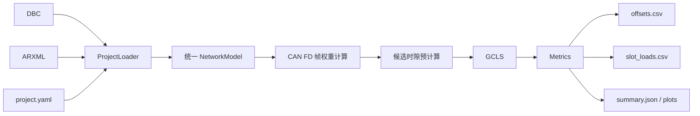

# 基于贪心构造与冲突导向局部搜索的 CAN FD 周期报文 Offset 均衡分配工具研究与设计说明书

**作者：篠見由紀**  
**文档用途：工程实现依据 / Codex 编码输入**

## 1. 文档目的

本说明书定义一个轻量、可解释、可直接工程实现的 CAN FD 周期报文 Offset 均衡分配工具。工具不构建完整 CAN 总线仿真器，也不模拟仲裁、FIFO 排队、软件处理时间、错误重传或端到端响应时间；它只解决一个明确问题：

> 在报文 ID、Cycle Time、DLC、发送节点和总线配置均保持不变的条件下，为每条周期 CAN FD 报文选择一个合法的首次发送延迟 Offset，使报文释放事件在离散时间轴上尽量均匀，降低局部工作负载峰值和同时释放数量。

当前工程目标即为上述 Offset 均衡分配工具本身。

## 2. 研究边界

工具只处理 DBC 中定义的周期 CAN FD 报文，不处理事件报文、诊断报文、网络管理报文和其他偶发流量。Offset 表示首次发送延迟，报文第 \(k\) 次释放时刻为

\[
r_{i,k}=O_i+kT_i,\qquad k=0,1,2,\ldots
\]

其中：

- \(T_i\)：报文周期；
- \(O_i\)：待求 Offset；
- 当前允许集合为 \(\{15,20,25,\ldots,100\}\ \mathrm{ms}\)。

5 ms 是 Offset 的离散步长，也是离散时间模型的时隙宽度；它不表示任意两条报文必须相隔 5 ms 才能发送。

工具输出推荐 Offset 和负载分布报告，不回写 DBC 或 ARXML。

## 3. 输入与数据来源

### 3.1 DBC

DBC 是报文数据的主来源，至少需要读取：

- 报文名称；
- CAN ID；
- 标准帧或扩展帧；
- 周期 Cycle Time；
- Payload Length / DLC；
- Sender ECU；
- 原始 Offset（若工程中存在）。

只保留周期报文。缺少周期、长度或发送节点时应给出明确错误，不允许静默猜测。

### 3.2 ARXML

ARXML 只补充计算帧权重所需的网络配置，目标字段包括：

- CAN FD Channel；
- Nominal Bitrate；
- Data Bitrate；
- BRS；
- 必要的控制器与通道映射。

推荐输入包含 Can、CanIf、EcuC；Com 可作为周期字段的交叉校验来源。解析器不得依赖文件名，应扫描 ARXML 目录并按 XML 内容识别模块。

### 3.3 project.yaml

`project.yaml` 保存算法规则和缺失字段的显式覆盖值，不重复维护完整通信矩阵。主要配置如下：

```yaml
network:
  channel: CAN1
  nominal_bitrate: null
  data_bitrate: null
  brs: null

optimization:
  slot_ms: 5
  hyperperiod_ms: auto
  hyperperiod_cap_ms: 5000
  offset_min_ms: 15
  offset_max_ms: 100
  offset_step_ms: 5
  random_restarts: 20
  hot_slot_count: 3
  conflict_candidate_cap: 6
  pair_neighbor_steps: [1, 2, 3]

model:
  weight_mode: frame_time_us
  average_load_limit: 0.75
```

字段优先级采用“工程文件优先、配置显式覆盖”的原则。任何覆盖都必须写入日志和结果摘要。

## 4. 数学模型

### 4.1 超周期与时隙

定义所有周期的最小公倍数：

\[
H=\operatorname{lcm}(T_1,T_2,\ldots,T_N)
\]

对于典型周期集合 \(\{10,20,50,100,500\}\ \mathrm{ms}\)，有 \(H=500\ \mathrm{ms}\)。设时隙宽度 \(\Delta=5\ \mathrm{ms}\)，则时隙数为

\[
M=H/\Delta=100.
\]

### 4.2 报文权重

每条报文的权重 \(C_i\) 使用估算的 CAN FD 帧总线占用时间，单位统一为整数微秒。若启用 BRS，可抽象为

\[
C_i=\frac{N_i^{\mathrm{nom}}}{R_{\mathrm{nom}}}+\frac{N_i^{\mathrm{data}}}{R_{\mathrm{data}}}.
\]

若无法获得可靠的 bitrate 或 BRS，工具可以在显式允许的情况下退化为 `payload_bytes` 或 `unit` 权重，但必须在输出中标记为近似模式。

### 4.3 稳态分析窗口

Offset 是首次发送延迟，因此绝对 Offset 会影响启动时间。主优化对象是所有报文均已启动后的稳态分布。定义

\[
O_{\max}=\max_i\max \mathcal A_i,
\]

稳态窗口取

\[
I^{ss}=[O_{\max},O_{\max}+H).
\]

启动窗口取

\[
I^{st}=[0,O_{\max}).
\]

稳态是主要目标，启动峰值作为次级目标。

### 4.4 时隙命中与负载

对每条报文 \(i\) 和候选 Offset \(o\)，预计算其在稳态窗口命中的时隙集合：

\[
\mathcal S^{ss}_{i,o}=\{s\mid o+kT_i\in I_s^{ss}\}.
\]

时隙 \(s\) 的加权负载为

\[
L_s^{ss}=\sum_i C_i a^{ss}_{i,O_i,s},
\]

同时释放数量为

\[
K_s^{ss}=\sum_i a^{ss}_{i,O_i,s}.
\]

启动窗口使用同样定义得到 \(L_s^{st}\)。

### 4.5 平均负载检查

长期平均理论负载为

\[
U_{\mathrm{avg}}=\sum_i\frac{C_i}{T_i}.
\]

Offset 不改变平均负载。若 \(U_{\mathrm{avg}}>0.75\)，工具仍可计算均衡 Offset，但必须把项目标记为“平均负载约束不可由 Offset 修复”，不得声称优化后平均负载降至 75%。

## 5. 优化目标

5 ms 时隙允许的设计负载为

\[
B=0.75\times 5000=3750\ \mu s.
\]

定义：

\[
N_{\mathrm{vio}}=\sum_s\mathbb I[L_s^{ss}>B],
\]

\[
V_{\mathrm{vio}}=\sum_s\max(0,L_s^{ss}-B),
\]

\[
Z^{ss}=\max_s L_s^{ss},\qquad Z^{st}=\max_s L_s^{st},
\]

\[
Q=\sum_s(L_s^{ss})^2,
\]

\[
K_{\max}=\max_sK_s^{ss}.
\]

最终评分采用词典序元组：

\[
F(\mathbf O)=
(N_{\mathrm{vio}},V_{\mathrm{vio}},Z^{ss},Z^{st},Q,K_{\max}).
\]

Python 元组可以直接进行词典序比较。禁止在主算法中使用未经论证的简单加权和，因为较低优先级指标不应抵消峰值约束恶化。

## 6. 主算法 GCLS

GCLS 全称为 **Greedy Construction and Conflict-directed Local Search**，由四个连续操作组成：

1. 贪心构造；
2. 单报文重定位局部搜索；
3. 冲突导向双报文搜索；
4. 随机重启并保留全局最优解。

### 6.1 候选时隙预计算

在搜索前，为每个 `(message, offset)` 预计算稳态和启动命中时隙。搜索时只修改这些时隙，避免反复展开整条时间轴。

### 6.2 贪心构造

报文排序键为：

```text
(cycle_time_ms 升序, frame_time_us 降序, can_id 升序)
```

短周期报文出现次数更多，应优先占据较好的相位；周期相同时，大帧优先。

```python
def greedy_construct(messages, allowed_offsets, state):
    ordered = sorted(
        messages,
        key=lambda m: (m.cycle_time_us, -m.frame_time_us, m.can_id),
    )

    for message in ordered:
        best_offset = None
        best_score = None

        for offset in allowed_offsets:
            state.apply(message, offset)
            score = state.score()
            state.rollback(message, offset)

            if best_score is None or score < best_score:
                best_score = score
                best_offset = offset

        state.apply(message, best_offset)

    return state.solution()
```

纯贪心不能回退早期决策，结果也会受排序影响，因此只作为初始解生成器。

### 6.3 单报文重定位

固定其他报文，逐条枚举当前报文的所有候选 Offset，接受使全局词典序目标严格改善的最佳位置。完整一轮没有任何改善时停止。

```python
def relocate_one_message(solution, state):
    improved = True

    while improved:
        improved = False

        for message in solution.messages:
            old_offset = solution.offset_of(message)
            old_score = state.score()
            state.remove(message, old_offset)

            best_offset = old_offset
            best_score = old_score

            for offset in message.allowed_offsets_us:
                state.apply(message, offset)
                score = state.score()
                state.rollback(message, offset)

                if score < best_score:
                    best_score = score
                    best_offset = offset

            state.apply(message, best_offset)

            if best_offset != old_offset and best_score < old_score:
                solution.set_offset(message, best_offset)
                improved = True

    return solution
```

该操作得到 1-opt 局部最优解。

### 6.4 冲突导向双报文搜索

单报文搜索可能停在平台区。工具选取负载最高的若干时隙，收集对这些热点有贡献的报文，只对该小集合尝试：

- 两条报文同时移动到邻近 Offset；
- 两条报文交换 Offset；
- 接受严格改善后重新执行单报文重定位。

邻域默认使用当前 Offset 的 \(\pm5\)、\(\pm10\)、\(\pm15\) ms，并与合法集合取交集。禁止无边界地枚举所有报文对和全部候选组合。

### 6.5 随机重启

贪心排序在周期和权重相同的报文之间存在任意性。工具执行固定次数的可复现随机重启，只打乱同一排序组内的顺序，每次运行完整 GCLS，最终保留词典序最优解。每次随机种子必须写入日志。

## 7. 工程数据流



解析层只负责把外部文件转换为统一模型；优化层不得直接访问 DBC、ARXML 或 XML 节点。

## 8. 输出

工具至少生成：

- `offsets.csv`：报文名称、ID、周期、权重、原 Offset、推荐 Offset；
- `slot_loads.csv`：每个稳态/启动时隙的负载和释放数量；
- `summary.json`：输入摘要、配置覆盖、优化前后指标、随机种子、运行时间；
- `steady_load.png`：稳态时隙负载图；
- `startup_load.png`：启动时隙负载图；
- `run.log`：完整运行日志。

## 9. 验收条件

程序满足以下条件才视为完成：

1. 所有输出 Offset 均属于合法集合；
2. 稳态窗口中每条报文释放次数恒为 \(H/T_i\)；
3. 任意 apply/rollback 后状态完全恢复；
4. 局部搜索只接受严格改善；
5. 相同输入和随机种子得到完全一致结果；
6. GCLS 结果不得劣于同一排序下的纯贪心结果；
7. 输出清楚区分平均负载、时隙释放负载和真实总线占用率；
8. 缺失关键字段时给出可定位的错误，不静默采用不透明默认值。

## 10. 不实现的内容

当前工程不实现：

- ECU FIFO 排队仿真；
- CAN 总线真实仲裁；
- Intermission、错误帧和重传；
- 发送端/接收端软件处理时间；
- 事件流量、诊断流量和网络管理流量；
- DBC/ARXML 自动回写；
- CP-SAT、遗传算法、模拟退火等主求解器。

CP-SAT 可用于独立的小规模结果核对，但不属于默认程序流程，也不应阻塞工程工具交付。

## 11. 参考资料

1. M. Grenier, L. Havet, N. Navet. *Pushing the Limits of CAN—Scheduling Frames with Offsets Provides a Major Performance Boost*. ERTS, 2008.
2. P. M. Yomsi, D. Bertrand, N. Navet, R. I. Davis. *Controller Area Network (CAN): Response Time Analysis with Offsets*. WFCS, 2012.
3. Robert Bosch GmbH. *M_CAN User’s Manual*, Revision 3.3.1.
4. Vector Informatik. CANdb++ / CANoe documentation.
