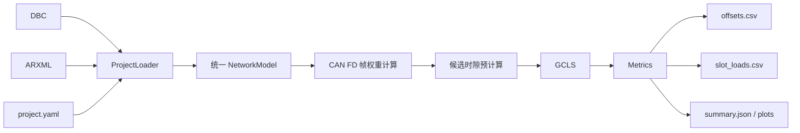

# 基于贪心构造与冲突导向局部搜索的 CAN FD 周期报文 Offset 均衡分配工具研究与设计说明书

**作者：篠見由紀**  
**文档用途：工程实现依据 / Codex 编码输入**

## 1. 文档目的

本说明书定义一个轻量、可解释、可直接工程实现的 CAN FD 周期报文 Offset 均衡分配工具。工具不构建完整 CAN 总线仿真器，也不模拟仲裁、FIFO 排队、软件处理时间、错误重传或端到端响应时间；它只解决一个明确问题：

> 在报文 ID、Cycle Time、DLC、发送节点和总线配置均保持不变的条件下，为每条周期 CAN FD 报文选择一个合法的首次发送延迟 Offset，使报文释放事件在离散时间轴上尽量均匀，降低局部工作负载峰值和同时释放数量。

当前工程目标即为上述 Offset 均衡分配工具本身。

## 2. 研究边界

工具只处理 DBC 中定义的周期 CAN FD 报文，不处理事件报文、诊断报文、网络管理报文和其他偶发流量。Offset 表示首次发送延迟，报文第 \(k\) 次释放时刻为

\[
r_{i,k}=O_i+kT_i,\qquad k=0,1,2,\ldots
\]

其中：

- \(T_i\)：报文周期；
- \(O_i\)：待求 Offset；
- 当前允许集合为 \(\{15,20,25,\ldots,100\}\ \mathrm{ms}\)。

5 ms 是 Offset 的离散步长，也是离散时间模型的时隙宽度；它不表示任意两条报文必须相隔 5 ms 才能发送。

工具输出推荐 Offset 和负载分布报告，不回写 DBC 或 ARXML。

## 3. 输入与数据来源

### 3.1 DBC

DBC 是报文数据的主来源，至少需要读取：

- 报文名称；
- CAN ID；
- 标准帧或扩展帧；
- 周期 Cycle Time；
- Payload Length / DLC；
- Sender ECU；
- 原始 Offset（若工程中存在）。

只保留周期报文。缺少周期、长度或发送节点时应给出明确错误，不允许静默猜测。

### 3.2 ARXML

ARXML 只补充计算帧权重所需的网络配置，目标字段包括：

- CAN FD Channel；
- Nominal Bitrate；
- Data Bitrate；
- BRS；
- 必要的控制器与通道映射。

推荐输入包含 Can、CanIf、EcuC；Com 可作为周期字段的交叉校验来源。解析器不得依赖文件名，应扫描 ARXML 目录并按 XML 内容识别模块。

### 3.3 project.yaml

`project.yaml` 保存算法规则和缺失字段的显式覆盖值，不重复维护完整通信矩阵。主要配置如下：

```yaml
network:
  channel: CAN1
  nominal_bitrate: null
  data_bitrate: null
  brs: null

optimization:
  slot_ms: 5
  hyperperiod_ms: auto
  hyperperiod_cap_ms: 5000
  offset_min_ms: 15
  offset_max_ms: 100
  offset_step_ms: 5
  restart_policy:
    mode: adaptive
    min_attempts: 20
    check_interval: 10
    patience_attempts: 20
    max_attempts: 80
  hot_slot_count: 3
  conflict_candidate_cap: 6
  pair_neighbor_steps: [1, 2, 3]
  variance_offset_cap: 3

model:
  weight_mode: frame_time_us
  average_load_limit: 0.75

objective:
  mode: balanced
  peak_tolerance:
    type: relative
    value: 0.05
  variance_metric: sum_of_squares
```

字段优先级采用“工程文件优先、配置显式覆盖”的原则。任何覆盖都必须写入日志和结果摘要。

## 4. 数学模型

### 4.1 超周期与时隙

定义所有周期的最小公倍数：

\[
H=\operatorname{lcm}(T_1,T_2,\ldots,T_N)
\]

对于典型周期集合 \(\{10,20,50,100,500\}\ \mathrm{ms}\)，有 \(H=500\ \mathrm{ms}\)。设时隙宽度 \(\Delta=5\ \mathrm{ms}\)，则时隙数为

\[
M=H/\Delta=100.
\]

### 4.2 报文权重

每条报文的权重 \(C_i\) 使用估算的 CAN FD 帧总线占用时间，单位统一为整数微秒。若启用 BRS，可抽象为

\[
C_i=\frac{N_i^{\mathrm{nom}}+3}{R_{\mathrm{nom}}}+\frac{N_i^{\mathrm{data}}}{R_{\mathrm{data}}}.
\]

其中额外的 3 bit 是按 nominal bitrate 计入的 intermission。当前实现采用包含协议字段、
动态填充上界、固定 CRC 填充和 intermission 的保守 ISO CAN FD 估算，并向上取整为正
整数微秒；它不是逐位仿真，也不是最坏响应时间分析。`CanControllerBaudRate` 与
`CanControllerFdBaudRate` 按 AUTOSAR/DaVinci 的 kbit/s 语义换算为 bit/s，
`CanControllerTxBitRateSwitch` 可作为 Controller 级 BRS 配置。

若无法获得可靠的 bitrate 或 BRS，工具可以在显式允许的情况下退化为 `payload_bytes` 或 `unit` 权重，但必须在输出中标记为近似模式。

### 4.3 稳态分析窗口

Offset 是首次发送延迟，因此绝对 Offset 会影响启动时间。主优化对象是所有报文均已启动后的稳态分布。定义

\[
O_{\max}=\max_i\max \mathcal A_i,
\]

稳态窗口取

\[
I^{ss}=[O_{\max},O_{\max}+H).
\]

启动窗口取

\[
I^{st}=[0,O_{\max}).
\]

稳态是主要目标，启动峰值作为次级目标。

### 4.4 时隙命中与负载

对每条报文 \(i\) 和候选 Offset \(o\)，预计算其在稳态窗口命中的时隙集合：

\[
\mathcal S^{ss}_{i,o}=\{s\mid o+kT_i\in I_s^{ss}\}.
\]

时隙 \(s\) 的加权负载为

\[
L_s^{ss}=\sum_i C_i a^{ss}_{i,O_i,s},
\]

同时释放数量为

\[
K_s^{ss}=\sum_i a^{ss}_{i,O_i,s}.
\]

启动窗口使用同样定义得到 \(L_s^{st}\)。

### 4.5 平均负载检查

长期平均理论负载为

\[
U_{\mathrm{avg}}=\sum_i\frac{C_i}{T_i}.
\]

Offset 不改变平均负载。若 \(U_{\mathrm{avg}}>0.75\)，工具仍可计算均衡 Offset，但必须把项目标记为“平均负载约束不可由 Offset 修复”，不得声称优化后平均负载降至 75%。

## 5. 优化目标

5 ms 时隙允许的设计负载为

\[
B=0.75\times 5000=3750\ \mu s.
\]

统一计算以下与模式无关的原始指标：

\[
N_{\mathrm{vio}}=\sum_s\mathbb I[L_s^{ss}>B],
\]

\[
V_{\mathrm{vio}}=\sum_s\max(0,L_s^{ss}-B),
\]

\[
Z^{ss}=\max_s L_s^{ss},\qquad Z^{st}=\max_s L_s^{st},
\]

\[
Q^{ss}=\sum_s(L_s^{ss})^2,\qquad
Q^{st}=\sum_s(L_s^{st})^2,
\]

\[
K_{\max}=\max_sK_s^{ss}.
\]

由于同一组报文在稳态超周期中的释放次数恒为 \(H/T_i\)，稳态总工作量和平均
时隙负载不随 Offset 改变。因此最小化 \(Q^{ss}\) 与最小化稳态负载方差等价，且全程
使用整数运算。启动窗口总工作量会随首次发送延迟改变，故启动指标始终保持
\(Z^{st}\) 在 \(Q^{st}\) 之前。

工具提供三种固定、安全且可审计的词典序，不开放任意 priorities：

严格峰值模式：

\[
F_{peak}(\mathbf O)=
(N_{\mathrm{vio}},V_{\mathrm{vio}},Z^{ss},Q^{ss},Z^{st},Q^{st},K_{\max}).
\]

方差实验模式：

\[
F_{variance}(\mathbf O)=
(N_{\mathrm{vio}},V_{\mathrm{vio}},Q^{ss},Z^{ss},Z^{st},Q^{st},K_{\max}).
\]

正式推荐的 balanced 模式先以相同 seed、重启次数运行严格峰值 GCLS，得到参考峰值
\(Z^*\)。该值是“严格峰值 GCLS 参考值”，不是数学全局最优证明。相对容差 \(\rho\)
和绝对容差 \(\delta\) 分别定义预算：

\[
Z_{budget}=\left\lceil(1+\rho)Z^*\right\rceil
\quad\text{或}\quad
Z_{budget}=Z^*+\delta.
\]

默认 \(\rho=0.05\)。balanced 比较键为：

\[
F_{balanced}(\mathbf O)=
(N_{\mathrm{vio}},V_{\mathrm{vio}},
\max(0,Z^{ss}-Z_{budget}),Q^{ss},Z^{ss},Z^{st},Q^{st},K_{\max}).
\]

实现把严格峰值解保留为可行保底，并对 balanced 最终结果施加硬校验：物理超限指标
不得比参考解恶化、稳态峰值不得超过预算、\(Q^{ss}\) 不得比参考解恶化。禁止跨目标
模式直接比较 Objective；禁止使用未经论证的简单加权和。

`balanced` 与 `variance` 只适用于 `frame_time_us`。`payload_bytes` 和 `unit` 会强制
退回 `peak` 并记录 warning，因为近似权重不具备可解释的微秒峰值预算。

## 6. 主算法 GCLS

GCLS 全称为 **Greedy Construction and Conflict-directed Local Search**，由四个连续操作组成：

1. 贪心构造；
2. 单报文重定位局部搜索；
3. 冲突导向双报文搜索；
4. 随机重启并保留所有已评价候选中的最好近似解。

### 6.1 候选时隙预计算

在搜索前，为每个 `(message, offset)` 预计算稳态和启动命中时隙。搜索时只修改这些时隙，避免反复展开整条时间轴。

### 6.2 贪心构造

报文排序键为：

```text
(cycle_time_ms 升序, frame_time_us 降序, can_id 升序)
```

短周期报文出现次数更多，应优先占据较好的相位；周期相同时，大帧优先。

```python
def greedy_construct(messages, allowed_offsets, state):
    ordered = sorted(
        messages,
        key=lambda m: (m.cycle_time_us, -m.frame_time_us, m.can_id),
    )

    for message in ordered:
        best_offset = None
        best_score = None

        for offset in allowed_offsets:
            state.apply(message, offset)
            score = state.score()
            state.rollback(message, offset)

            if best_score is None or score < best_score:
                best_score = score
                best_offset = offset

        state.apply(message, best_offset)

    return state.solution()
```

纯贪心不能回退早期决策，结果也会受排序影响，因此只作为初始解生成器。

### 6.3 单报文重定位

固定其他报文，逐条枚举当前报文的所有候选 Offset，接受使全局词典序目标严格改善的最佳位置。完整一轮没有任何改善时停止。

```python
def relocate_one_message(solution, state):
    improved = True

    while improved:
        improved = False

        for message in solution.messages:
            old_offset = solution.offset_of(message)
            old_score = state.score()
            state.remove(message, old_offset)

            best_offset = old_offset
            best_score = old_score

            for offset in message.allowed_offsets_us:
                state.apply(message, offset)
                score = state.score()
                state.rollback(message, offset)

                if score < best_score:
                    best_score = score
                    best_offset = offset

            state.apply(message, best_offset)

            if best_offset != old_offset and best_score < old_score:
                solution.set_offset(message, best_offset)
                improved = True

    return solution
```

该操作得到 1-opt 局部最优解。

### 6.4 冲突导向双报文搜索

单报文搜索可能停在平台区。`peak` 继续选取负载最高的有限时隙，并使用原有削峰候选
策略。`balanced` 和 `variance` 则把所有高于稳态平均负载的时隙视为方差热点，按照
报文从热点移除后可降低的 \(\Delta Q\) 对候选报文排序。只对该小集合尝试：

- 两条报文同时移动到邻近 Offset；
- 两条报文交换 Offset；
- 每条候选报文最多加入 3 个全局最低“加入增量 \(\Delta Q\)” Offset；
- 接受严格改善后重新执行单报文重定位。

邻域默认使用当前 Offset 的 \(\pm5\)、\(\pm10\)、\(\pm15\) ms，并与合法集合取交集。禁止无边界地枚举所有报文对和全部候选组合。

### 6.5 可复现 RestartPolicy

贪心排序在周期和权重相同的报文之间存在任意性。每批首次尝试使用确定性 Greedy 顺序，后续
尝试只在同周期、同权重组内按局部 `random.Random(seed)` 打乱，不污染进程全局随机状态。
`attempts` 统一包含首次确定性尝试。

默认自适应策略至少执行 20 次，此后每 10 次检查完整 Peak 词典序目标；连续 20 次没有严格
改善则停止，最多 80 次。相同目标下 assignment tie-break 的改善不重置 patience。达到上限
时必须记录 `max_attempts_reached=true` 和“达到上限但未验证饱和”，不能表述为已充分搜索。
fixed 策略用于严格固定成本实验。balanced 和 variance 复用 Peak 阶段实际 attempts 与 seed
序列，避免跨模式比较的搜索预算漂移。

每次尝试都保存 attempt index/kind、seed、完整命名目标、完整 Offset assignment、按
`(definition_index, CAN ID, message name)` 规范排序得到的 SHA-256、运行时间、评价次数和
接受次数。长实验使用逐行 flush 的 append-only JSONL；恢复前校验输入哈希、规范化配置哈希、
主键唯一性、JSON 完整性和 assignment hash。

### 6.6 启发式边界与独立验证

GCLS 的目标是获得高质量、可复现的近似解，不提供全局最优性证明。实现通过三类独立诊断
区分“单次 restart 敏感”“完整批次不稳定”和“局部搜索未命中预算内改善”：

1. 多批独立 seed 集合与 prefix-best 曲线评估 restart 饱和度；
2. `0%,2%,5%,8%,10%,15%,20%` 峰值宽容扫描观察离散 `Zss-Qss` Pareto 台阶；
3. 可选 CP-SAT 在完全相同的 Offset、窗口、multiplicity、权重和峰值预算下最小化 `Qss`。

CP-SAT 只作为诊断求解器。只有 solver status 为 `OPTIMAL` 时，才能声明固定离散模型与预算
下的最优值；`FEASIBLE` 只报告 best feasible、best bound 与 gap；`UNKNOWN` 或
`INFEASIBLE` 不能解释为 GCLS 已达到全局最优。

## 7. 工程数据流



解析层只负责把外部文件转换为统一模型；优化层不得直接访问 DBC、ARXML 或 XML 节点。

## 8. 输出

工具至少生成：

- `offsets.csv`：报文名称、ID、周期、权重、原 Offset、推荐 Offset；
- `slot_loads.csv`：每个稳态/启动时隙的负载和释放数量；
- `summary.json`：输入摘要、配置覆盖、优化前后指标、随机种子、运行时间；
- `steady_load.png`：稳态时隙负载图；
- `startup_load.png`：启动时隙负载图；
- `run.log`：完整运行日志。

## 9. 验收条件

程序满足以下条件才视为完成：

1. 所有输出 Offset 均属于合法集合；
2. 稳态窗口中每条报文释放次数恒为 \(H/T_i\)；
3. 任意 apply/rollback 后状态完全恢复；
4. 局部搜索只接受严格改善；
5. 相同输入和随机种子得到完全一致结果；
6. GCLS 结果不得劣于同一排序下的纯贪心结果；
7. 输出清楚区分平均负载、时隙释放负载和真实总线占用率；
8. 缺失关键字段时给出可定位的错误，不静默采用不透明默认值。

## 10. 不实现的内容

当前工程不实现：

- ECU FIFO 排队仿真；
- CAN 总线真实仲裁；
- 错误帧和重传（正常帧后的 3-bit intermission 已计入权重）；
- 发送端/接收端软件处理时间；
- 事件流量、诊断流量和网络管理流量；
- DBC/ARXML 自动回写；
- 遗传算法、模拟退火等主求解器；
- 把 CP-SAT 纳入默认生产优化流程。

CP-SAT 可作为安装 `solver` extra 后的独立诊断命令，用于小规模穷举一致性检查和重点网段的
限时上下界对照；它不属于默认程序流程，也不应阻塞工程工具交付。

## 11. 参考资料

1. M. Grenier, L. Havet, N. Navet. *Pushing the Limits of CAN—Scheduling Frames with Offsets Provides a Major Performance Boost*. ERTS, 2008.
2. P. M. Yomsi, D. Bertrand, N. Navet, R. I. Davis. *Controller Area Network (CAN): Response Time Analysis with Offsets*. WFCS, 2012.
3. Robert Bosch GmbH. *M_CAN User’s Manual*, Revision 3.3.1.
4. Vector Informatik. CANdb++ / CANoe documentation.
